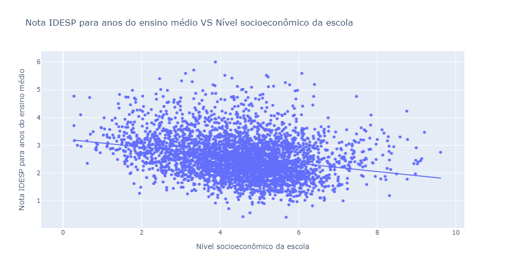

# Relação entre desempenho escolar e nível socioeconômico

## Objetivo
Investigar a relação entre o desempenho escolar e o nível socioeconômico das escolas da rede estadual de ensino do estado de São Paulo, regredindo os dados com um modelo OLS simples univariado, e utilizando a linguagem Python.

## Dados
Para este trabalho foram utilizados dados referentes ao indicador IDESP de desempenho escolar dos estudantes do ensino médio e o índice de nível socioeconômico, INSE, das escolas do estado de São Paulo. As duas bases de dados foram retiradas do site basedosdados.
O indicador IDESP busca avaliar a qualidade das escolas e considera dois parâmetros:
i)	O desempenho dos alunos nos exames de proficiência do SARESP, para identificar o quanto eles aprendem, e;
ii)	O fluxo escolar destes alunos, para saber em quanto tempo eles aprendem.
A variável especifica que utilizamos como dependente aqui é a nota IDESP para anos do ensino médio, por entender que esta é uma fase determinante para o desempenho posterior dos alunos no ENEM, e consequentemente, em seu acumulo de capital humano pós ensino básico.
Já o INSE é calculado a partir dos questionários do SARESP e considera 3 variáveis:
a)	O grau de escolaridade dos pais;
b)	Posse de bens de consumo duráveis na residência;
c)	Posse de bens de consumo duráveis na residência.
Ainda, seu valor varia de 0 a 10, sendo 10 a escola com o nível socioeconômico mais baixo e 0 a escola com nível mais alto.

# Roteiro

## Importação e Manipulação dos dados
Para esta primeira etapa foram utilizados os comandos dos seguintes pacotes:
* `basedosdados`(Importe);
* `pandas`(Manipulação)

## Econometria
Nesta parte foram utilizados os pacotes:
* `plotly.express`;
* `statsmodels.api`

## Visualização dos dados
Na visualização dos dados foi utilizado o mesmo pacote `plotly.express` já mencionado acima, e a imagem do gráfico de dispersão com a linha de OLS traçada no meio pode ser vista abaixo:

Além disso, esta imagem pode ser encontrada na pasta "image" deste repositório.